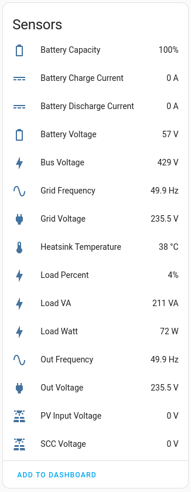

# Inverter data to MQTT
Dump inverter sensors into mqtt

At the moment program only supports interacting with an invertor via a raw `USB` interface. `RS-232` support will be added later.

The program was written for the `PowMr 5KVA 48V`:


Special thanks to Dolf Andringa for his beautiful article:
[Reverse engineering cypress serial USB](http://allican.be/blog/2017/01/28/reverse-engineering-cypress-serial-usb)

# Build

```bash
cargo build --release
```

# Run

```bash
./target/release/inverter2mqtt powmr.yaml
```

You can find an example configuration file for `PowMr` inverter in the repository: [powmr.yaml](https://github.com/anti-social/inverter2mqtt/blob/master/powmr.yaml)

# Home Assistant

Sensors data should be caught by Home Assistant automatically.


